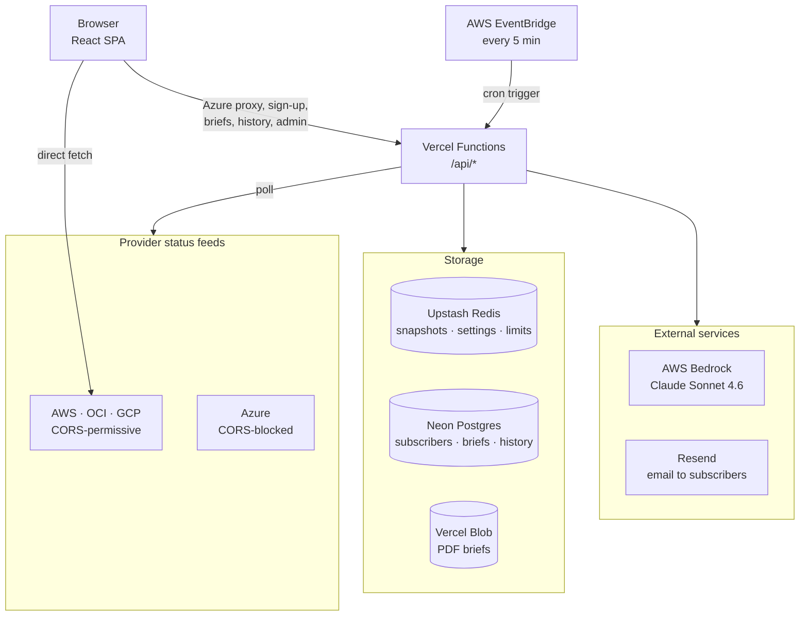
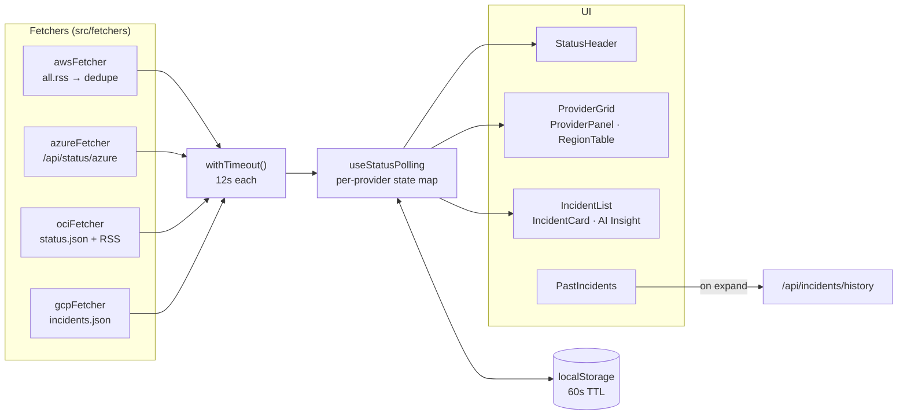
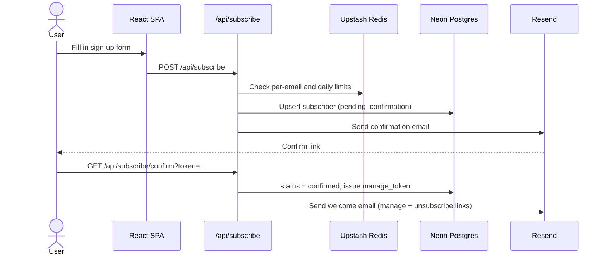
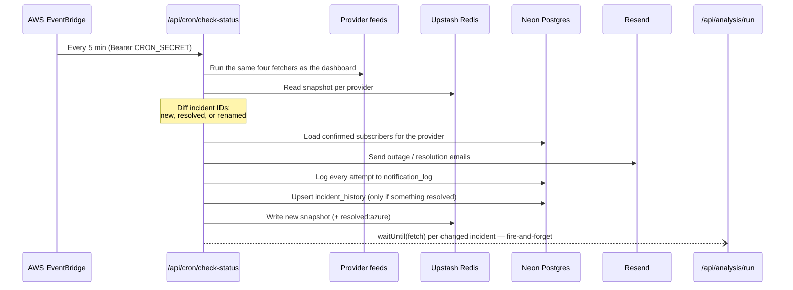
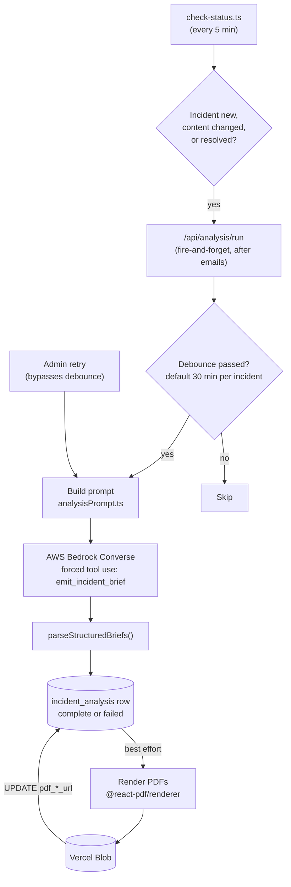
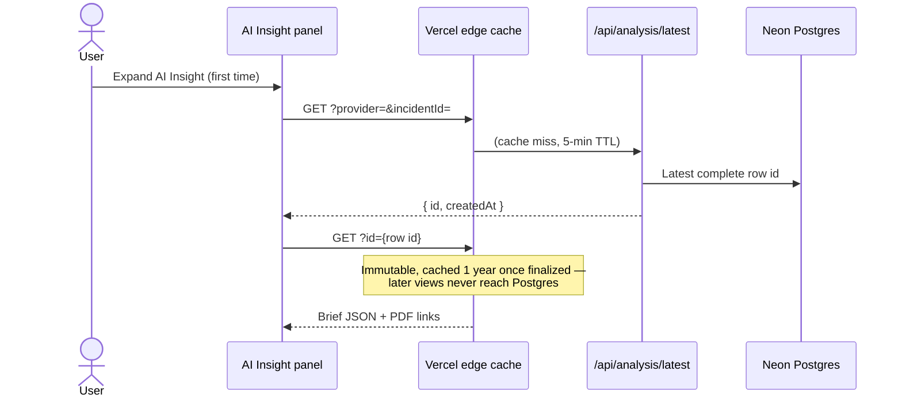
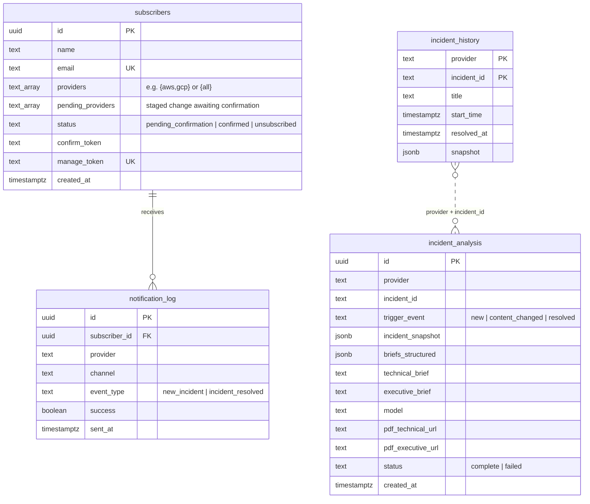

# Cloud Status Hub

[](https://cloudstatus.synepho.com)


Real-time operational status dashboard for AWS, Azure, OCI, and GCP in a single unified view. Built for cloud engineers and anyone who needs a quick read on cloud provider health.

**What it does**

- **Live dashboard** — current status of all four providers, refreshed every 60 seconds, with a region × service breakdown, active and recently resolved incidents, and links to each official status page.
- **Email alerts** — opt in (double opt-in) to hear when a provider you follow reports a new incident, and again when it resolves.
- **AI Insight** — each incident gets an AI-generated technical brief and executive brief (AWS Bedrock, Claude), shown on the dashboard and downloadable as a branded PDF.
- **Past incidents** — resolved incidents are kept for 90 days, with links to their AI briefs.
- **Admin** — subscriber management, AI run history, retry, and live settings behind Sign in with Vercel.

## Contents

- [Architecture](#architecture)
- [Tech stack](#tech-stack)
- [Dashboard](#dashboard)
- [Email alerts](#email-alerts)
- [Incident Briefing Engine (AI Insight)](#incident-briefing-engine-ai-insight)
- [Past incidents (90-day history)](#past-incidents-90-day-history)
- [Admin](#admin)
- [Data model](#data-model)
- [Infrastructure and configuration](#infrastructure-and-configuration)
- [Project structure](#project-structure)
- [Local development](#local-development)
- [Deployment](#deployment)
- [Observability](#observability)
- [Known constraints](#known-constraints)
- [Roadmap](#roadmap)

---

## Architecture

### System overview

The dashboard is a static React SPA. Three of the four providers are fetched
straight from the browser; everything else — the Azure proxy, sign-ups,
change detection, AI briefs, and admin — runs as Vercel Functions.



The rest of this README walks through each part: the
[dashboard](#dashboard) data path, [email alerts](#email-alerts), the
[AI Insight](#incident-briefing-engine-ai-insight) pipeline, and
[admin](#admin).

### Serverless functions

Vercel's Hobby plan caps a deployment at 12 functions, so several routes
share one file (a `vercel.json` rewrite maps the bare path to a bracket
file, which the handler reads as "no id/action given").

| Function | Routes | Access | Purpose |
| --- | --- | --- | --- |
| `api/status/azure.ts` | `GET /api/status/azure` | Public | Azure feed proxy, normalized to the unified schema, plus 24h of resolved incidents from Redis |
| `api/subscribe/[action].ts` | `POST /api/subscribe`, `/confirm`, `/manage`, `/unsubscribe` | Public / token | Sign-up, confirmation, manage, unsubscribe |
| `api/auth/[action].ts` | `/api/auth/authorize`, `/callback`, `/signout` | Public | Sign in with Vercel (PKCE) and admin session cookie |
| `api/admin/subscribers/[id].ts` | `GET /api/admin/subscribers`, `PATCH`/`DELETE /api/admin/subscribers/:id` | Admin | Subscriber list, filters, CSV, manual actions |
| `api/admin/test-email.ts` | `POST /api/admin/test-email` | Admin | Send any email template to a confirmed subscriber |
| `api/admin/analysis-admin.ts` | `/api/admin/analysis-admin?resource=…` | Admin | AI run history, retry, delete, cleanup, settings, PDF redirect |
| `api/analysis/run.ts` | `POST /api/analysis/run` | `CRON_SECRET` | Generate an AI brief for one incident |
| `api/analysis/latest.ts` | `GET /api/analysis/latest` | Public | Latest brief pointer, or immutable brief content by id |
| `api/incidents/history.ts` | `GET /api/incidents/history` | Public | Incidents resolved 24h–90d ago |
| `api/cron/check-status.ts` | `/api/cron/check-status` | `CRON_SECRET` | Change detection, email dispatch, AI and history triggers |
| `api/cron/cleanup.ts` | `/api/cron/cleanup` | `CRON_SECRET` | Daily retention purge |

---

## Tech stack

| Layer | Technology |
| --- | --- |
| Frontend | React 18 + Vite 7 |
| Language | TypeScript 5.6 |
| Styling | Tailwind CSS 3 (dark mode via `class` strategy, plus a system-preference mode) |
| XML parsing | `fast-xml-parser` 5 (browser + serverless) |
| Serverless | Vercel Functions (Node.js) |
| Database | Neon Postgres (Vercel Marketplace) |
| Cache / state | Upstash Redis (Vercel Marketplace) |
| Email | Resend, from `alerts.synepho.com` |
| AI / LLM | AWS Bedrock — Claude Sonnet 4.6 (`us.anthropic.claude-sonnet-4-6`), via Vercel OIDC → AWS federation |
| PDF generation | `@react-pdf/renderer`, stored in Vercel Blob |
| Admin auth | Sign in with Vercel (OAuth, PKCE) |
| Scheduling | AWS EventBridge (every 5 min) + Vercel cron (daily) |
| Analytics | Vercel Web Analytics, Speed Insights, GA4 |

---

## Dashboard

### Data sources

| Provider | Dashboard | Data URL | Format | CORS | Fetched via |
| --- | --- | --- | --- | --- | --- |
| AWS | https://status.aws.amazon.com/ | `.../rss/all.rss` | RSS/XML | ✅ Direct | Browser |
| Azure | https://azure.status.microsoft/ | `rssfeed.azure.status.microsoft/...` | RSS/XML | ❌ Blocked | `/api/status/azure` |
| OCI | https://ocistatus.oraclecloud.com/ | `.../api/v2/status.json` + `.../api/v2/incident-summary.rss` | JSON + RSS | ✅ Direct | Browser |
| GCP | https://status.cloud.google.com/ | `.../incidents.json` | JSON | ✅ Direct | Browser |

Panels are always shown in this order: **AWS → Azure → OCI → GCP**.

**Coverage notes**

- **AWS** — `all.rss` covers only incidents AWS publishes publicly (significant or widespread events). Minor single-service degradations appear only in per-service feeds. The feed emits one item per *update*, so items are deduplicated by GUID.
- **Azure** — the public feed covers only major widespread incidents. Affected services and regions come from `<category>` elements (or the title, then the description, as fallbacks) and are rolled up into the same region × service breakdown as the other providers, matched against a top-10 service list with anything else under "Multiple Services *". Full per-account detail would need the authenticated Azure Service Health API.
- **OCI** — `status.json` is only a bare `{indicator, description}` summary. `incident-summary.rss` supplies one stable-guid item per incident, with region and service parsed from its `"{service} | {region} | {ref}"` title.
- **GCP** — `incidents.json` is structured; services are matched to a top-10 list by stable `productId` (verify with `npm run verify:gcp`).

### Data path



Every fetcher returns the same unified `ProviderStatus` schema
(`src/types/status.ts`). Each provider settles independently: a card renders
the moment its own fetch resolves, and a slow or hung provider only delays
its own card (skeleton, then an error card after 12s). If all four fail —
e.g. the network is down — the last good data stays on screen.

### Refresh and caching

| Behavior | Detail |
| --- | --- |
| Auto-refresh interval | 60 seconds; pauses while the tab is hidden, fetches immediately on focus |
| Manual refresh cooldown | 60 seconds (starts after fetch completes) |
| Client cache (localStorage) | 60s TTL — hydrated on page load |
| Azure proxy cache | `s-maxage=300, stale-while-revalidate=60` |
| AI brief cache | Pointer `s-maxage=300`; content `s-maxage=31536000, immutable` once finalized — see [Reading a brief back](#reading-a-brief-back) |
| Past incidents cache | `s-maxage=3600, stale-while-revalidate=86400` |
| Offline behavior | Auto-refresh pauses; banner shown; cached data displayed |
| Stale data indicator | Yellow banner if the last fetch failed but cached data is available |
| Stale app bundle | `useVersionCheck` polls `/version.json` every 5 min and on tab focus; a banner offers Reload when a new deploy is live |

---

## Email alerts

| Route | Purpose |
| --- | --- |
| `/` — "Get alerts" header button, the all-clear message, "Alert me about &lt;provider&gt;" on incident cards, or `/?subscribe=1[&provider=aws]` | Sign-up form: name, email, provider checkboxes, hidden honeypot. Incident cards and `&provider=` pre-tick that provider |
| `/manage?token=...` | Edit providers or unsubscribe (link from the welcome email and every alert) |

### Sign-up and confirmation



- **Abuse protection** (`api/_lib/signupLimits.ts`):
  - a hidden honeypot field (`hpField`); if a bot fills it, the request gets a normal-looking success response but no email is sent
  - at most 3 sign-up attempts per email address per 24h (the Redis key is a SHA-256 of the address, so Redis never holds emails)
  - at most 30 sign-up attempts per UTC day overall, keeping confirmation mail well inside Resend's Free plan (100 emails/day, shared with outage alerts)

  Over-limit requests get a 429 with a plain-language message. A Redis error fails open, and double opt-in still applies. There is deliberately **no per-IP limit**: Zscaler-style corporate proxies send a whole company's traffic out through a few shared IPs.

  **Why not Vercel BotID (removed 2026-10-01):** its browser challenge was blocked by Zscaler, so sign-ups from Zscaler-managed corporate laptops got a 403 "Request blocked". Many cloud engineers work behind proxies like this. Double opt-in already stops bots from subscribing anyone; the only remaining risk is the form being used to send email, which the limits above bound directly.
- **Re-confirmation:** new sign-ups *and* any provider change made through the public form need a click on a confirmation link before taking effect, since that form is unauthenticated. Resubmitting an email that's still `pending_confirmation` reissues the same link; resubmitting an `unsubscribed` email starts a fresh sign-up.
- **Welcome email:** sent once after first confirmation and carries the `/manage` and unsubscribe links (`manage_token` doesn't exist until then).
- **Manage:** edits via `/manage?token=...` apply immediately — the token already proves inbox ownership.
- **Unsubscribe:** the email link opens `/manage?token=...&action=unsubscribe` with a Cancel / "Yes, unsubscribe" panel rather than unsubscribing on click. That's still one step from the email (CAN-SPAM), but a link scanner prefetching the URL can't unsubscribe anyone. `GET /api/subscribe/unsubscribe` itself stays idempotent.

### Change detection and notification dispatch



- **New incident** = an incident ID that wasn't in the previous snapshot, not "overall status went non-operational". A status-based trigger would miss a new incident while an unrelated one already has the provider degraded. The first check ever recorded for a provider is a baseline only.
- **Resolved** = an ID in the last snapshot that's missing from the fresh fetch. Works whether a provider publishes an explicit resolved marker or just drops the entry.
- **Renamed** = a vanished ID and a new ID from the same provider, in the same poll, with the same `startTime`. Azure has no stable incident ID, so retitling an incident changes its derived ID; these pairs are treated as one incident (no emails, AI brief re-run under the new ID) instead of a false resolved + new pair. Ambiguous matches fall through to normal handling (`api/_lib/incidentRenames.ts`).
- **Dispatch:** confirmed subscribers following the provider (or `"all"`) are emailed in parallel; every attempt — success or failure — is logged to `notification_log`. Emails list the affected regions and link to a dashboard deep link (`/?provider=…&incidentId=…`) that scrolls to the incident and opens its AI Insight panel.
- **Azure resolved incidents:** Azure's feed just drops a cleared incident, so its last snapshot is saved to Redis `resolved:azure` and merged back into `/api/status/azure` for 24h.
- **Cadence:** Vercel Hobby's native cron runs at most once a day — too coarse for alerting — so an AWS EventBridge Rule calls `check-status` every 5 minutes through an API Destination (`Authorization: Bearer $CRON_SECRET`). Vercel's daily cron stays wired as a free fallback. Provisioned by `scripts/setup-eventbridge-cron.sh`.

---

## Incident Briefing Engine (AI Insight)

AI-generated technical and executive briefs for each incident, built on AWS
Bedrock (Claude Sonnet 4.6), shown in the dashboard's **AI Insight** panel
and downloadable as branded PDFs. For a deeper walkthrough of the prompt,
how to iterate on it, and a plan for editing it from the admin UI, see
[`docs/PROMPT-REFINEMENT-GUIDE.md`](./docs/PROMPT-REFINEMENT-GUIDE.md).

### Generating a brief



- **Trigger:** `check-status.ts` hashes each active incident's `status + latestUpdate + affectedServices + affectedRegions` and stores the hash in the Redis snapshot. An incident triggers a brief when it's `new`, `content_changed` (same ID, different hash — catches a vendor editing text in place), or `resolved`.
- **Never delays an email:** the trigger is a `waitUntil(fetch('/api/analysis/run'))` placed after `notifySubscribers()`, never awaited, so a slow or failed Bedrock call can't block a notification.
- **Debounce:** default 30 minutes per incident. The Redis key `settings:analysis-debounce-minutes` (editable from admin) overrides the `ANALYSIS_DEBOUNCE_MINUTES` env default without a redeploy.
- **Prompt:** `api/_lib/analysisPrompt.ts` includes a hand-curated resiliency reference table per service category, so the model cites reviewed guidance rather than inventing specifics from a thin vendor paragraph, and a hard rule keeps DR/failover advice conditional ("if a failover path exists, consider…").
- **Model:** `BEDROCK_MODEL_ID` must be a cross-region inference profile ID — Claude models on Bedrock have no bare on-demand ID. Production uses `us.anthropic.claude-sonnet-4-6`; the code default (`us.anthropic.claude-sonnet-5`) isn't usable on this AWS account until Sonnet 5/5.5 access clears with AWS support (see `claude.md` §9, Marketplace IAM row).
- **Auth to Bedrock:** Vercel OIDC → `sts:AssumeRoleWithWebIdentity` via `@vercel/oidc-aws-credentials-provider` — no static AWS keys. Role provisioned by `scripts/setup-bedrock-oidc.sh` (`api/_lib/bedrock.ts`).
- **Storage:** one `incident_analysis` row per trigger, not per incident. A failed run (Bedrock error, malformed tool response, missing field) still writes a `status='failed'` row with the error, so a trigger is never lost silently.
- **PDFs:** rendered once per row after the text is saved, as a best-effort step that can never affect the published brief (`api/_lib/pdf/`). Helvetica built-in fonts, Synepho-branded, uploaded to `incident-analysis/{provider}/{incident-slug}/{row-id}-{technical|executive}.pdf` with a 1-year immutable cache. A footer on every page carries the disclaimer and a "Powered by Synepho" line. The dashboard shows "Download PDF" only once a URL exists.

### Structured briefs

The `emit_incident_brief` tool schema asks the model for fixed fields
(`src/utils/structuredBrief.ts`) rather than free-form markdown, which
drifted in format from run to run:

- **Technical:** `whatWeKnow`, `nextActions[]`, `servicesToCheck[]`, `resiliencyQuestions[]`. Actions and question groups carry an urgency: `immediate` (red), `high` (orange), `medium` (amber), `monitor` (blue).
- **Executive:** `bottomLine` (stance `act-now` / `decide-if-confirmed` / `awareness`), `whatsHappening`, `seriousness`, `customerImpact` (likelihood `yes` / `possible` / `unlikely`), and conditional `decisions[]`.

`parseStructuredBriefs()` drops malformed list items, sorts lists most-urgent
first, and fails the run if a required field is missing. The JSON is stored
in `incident_analysis.briefs_structured`; `StructuredBrief.tsx` (dashboard)
and `BriefDocument.ts` (PDF) render it with the same section order and
colors. `technical_brief`/`executive_brief` still get a plain-text rendering
for anything reading those columns, and rows from before structured briefs
render through the older markdown path (`formatBriefText.tsx` /
`renderBriefBody()`).

Layout: a panel at least 1100px wide (a container query on
`.ai-insight-body`, not the viewport) splits each brief into two columns;
narrower panels, phones, and the PDF use one column. The status chip is
hidden when the provider reports `unknown` (Azure's feed has no status).

### Reading a brief back



- Nothing is fetched until someone expands the panel.
- The dashboard always shows only the **latest** complete brief for an incident — an older version can contradict the incident's current status. Earlier rows stay in Postgres for admin history and retry.
- The pointer can't change faster than the debounce interval, so a 5-minute cache is safe. Content for a row id never changes once finalized (both PDF URLs present, or the row is 5 minutes old), so it's cached as immutable. Past-incident cards already carry their brief id and skip the pointer request.
- Why it's split this way, and why it's one function rather than two: see [CHANGELOG.md → Pointer/content split](./CHANGELOG.md#pointercontent-split-2026-09-02).

---

## Past incidents (90-day history)

The dashboard shows **Recently resolved** (last 24h, straight from the
provider feeds) and a collapsed **Past incidents · last 90 days** section
below it. Provider feeds keep almost no history — GCP's `incidents.json`
holds a handful of incidents, AWS's `all.rss` a few dozen updates — so the
app records its own.

- **Write:** `check-status.ts` upserts one `incident_history` row per resolved incident (`api/_lib/incidentHistory.ts`), merging the last active snapshot (real start time and severity) with the provider's own resolved entry when there is one (real end time and final text). Renamed incidents are skipped. It only runs on ticks where something resolved, so Neon isn't woken every 5 minutes.
- **Read:** `GET /api/incidents/history?cursor=` returns incidents resolved 24h–90d ago, 50 per page, each with its latest complete AI brief id. Only called when the section is expanded, and edge-cached for 1h.
- **Retention:** `cleanup.ts` deletes rows older than `HISTORY_RETENTION_DAYS` (90). Linked `incident_analysis` rows are pruned separately (see [AI run history and retention](#ai-run-history-and-retention)).
- **Backfill:** migration 008 seeded the table from existing `resolved` rows in `incident_analysis`.
- **Cost:** under 10 MB at 90 days (Neon Free: 0.5 GB); writes ride along with the resolved-brief run that already wakes Neon.
- **Known gap:** an incident that opens and resolves between two 5-minute ticks is never seen as active, so it isn't recorded.

---

## Admin

`/admin` is gated behind Sign in with Vercel.

- **Auth:** any Vercel user can complete the OAuth flow; the real access check is the callback comparing the `id_token`'s `email` claim to `ADMIN_EMAIL`, bouncing anyone else with `?error=forbidden`. A separate HMAC-signed session cookie (7-day expiry) is then issued, independent of Vercel's 1-hour access token.
- **Subscribers:** `GET /api/admin/subscribers` with `status`, `provider`, and `q` (name/email substring) filters; `?format=csv` exports with the same filters. `PATCH /api/admin/subscribers/:id` supports `resend_confirmation` / `force_unsubscribe`; `DELETE` hard-deletes.
- **Test email:** `/api/admin/test-email` sends any notification template to a real confirmed subscriber's address.
- **AI settings:** the debounce interval and a per-provider kill switch (`settings:analysis-disabled-providers` in Redis, read once per cron tick, fails open). The kill switch only stops AI briefs — outage and resolution emails still go out.

### AI run history and retention

Run history (`RunHistoryPanel.tsx`) lists the last 200 `incident_analysis`
rows, including failures. Any row can be re-run — not just failed ones, e.g.
to pick up a prompt change — which always inserts a new row through the
same pipeline with `bypassDebounce: true`. PDF links go through
`/api/admin/analysis-admin?resource=pdf&kind=…&id=…`, which checks the
stored URL server-side before redirecting, so database values never reach
an `href`.

The dashboard only ever shows an incident's newest complete run, so older
runs pile up unreachable. `api/_lib/runRetention.ts` labels every run in one
SQL query, shared by the **Link** column and the **Clean up unused (N)**
button so the two can't disagree:

| Label | Meaning | Cleanup |
| --- | --- | --- |
| **Active** | Newest complete run of a currently active incident | Kept |
| **Past · until &lt;date&gt;** | Newest complete run of an incident in `incident_history` (resolved within 90 days) | Kept |
| **Recent** | Newest complete run from the last 24h (safety net for a resolved incident whose history row was never written) | Kept |
| **Superseded · grace** | Replaced less than 2h ago — edge caches may still serve its id | Kept |
| **Failed · kept** | A failure with no successful run since, under 30 days old | Kept |
| **Superseded** | Replaced by a newer complete run | Removed |
| **Failed · resolved** | Retried successfully, or older than 30 days | Removed |
| **Unlinked** | Not reachable from the dashboard | Removed |

Cleanup is manual only. It deletes rows and their Blob PDFs in one
statement, so classification and deletion see the same snapshot, and it
refuses to run if any provider's Redis status snapshot is missing or more
than 24h old. A per-row Delete still works on a linked run but warns that
the dashboard's AI Insight panel may stop working.

---

## Data model



The full DDL is in `scripts/db/*.sql`. A few notes:

- **One person, one row.** `pending_providers` holds a staged edit awaiting re-confirmation. `"all"` is stored as a literal sentinel so future providers are included automatically.
- **`incident_analysis` has one row per trigger**, indexed on `(provider, incident_id, created_at DESC)` for the debounce check and latest-brief lookup.
- **`provider_status_snapshot`** (migrations 003/005) is unused and kept only as a historical record — snapshots moved to Redis (see below).

**Redis keys** (Upstash):

| Key | Purpose |
| --- | --- |
| `snapshot:<provider>` | Last-seen incident IDs, titles, and content hashes for change detection |
| `resolved:azure` | Azure incidents that vanished from the feed, shown as resolved for 24h |
| `settings:analysis-debounce-minutes` | Live AI debounce override |
| `settings:analysis-disabled-providers` | Per-provider AI kill switch |
| sign-up limit counters | Per-email (hashed) and per-day sign-up counts |

Snapshots live in Redis rather than Postgres because a query every 5
minutes kept Neon's compute from ever autosuspending; Redis bills per
request instead. See [CHANGELOG.md → Status snapshots moved to Redis](./CHANGELOG.md#status-snapshots-moved-from-postgres-to-redis).

---

## Infrastructure and configuration

| Piece | Role | Status |
| --- | --- | --- |
| Vercel | SPA hosting, functions, daily cron fallback, Blob | Live |
| Neon Postgres (Marketplace) | Subscribers, notification log, AI briefs, incident history | Live |
| Upstash Redis (Marketplace) | Status snapshots, settings, sign-up limits | Live |
| Resend | Confirmation, welcome, outage, and resolution email from `alerts.synepho.com` | Live, domain verified |
| AWS EventBridge (Rule + Connection + API Destination) | Calls `/api/cron/check-status` every 5 minutes — `scripts/setup-eventbridge-cron.sh` | Live |
| AWS Bedrock | AI briefs via OIDC federation — `scripts/setup-bedrock-oidc.sh` | Live |
| Vercel Blob | PDF briefs, public, 1-year immutable cache | Live |
| Sign in with Vercel | Admin auth, restricted to `ADMIN_EMAIL` | Live |
| Bot protection | Honeypot + per-email/daily sign-up limits (BotID removed) | Live |
| Vercel Firewall | Rate limit on `/api/subscribe` (5 req/60s/IP) | Live |
| AWS Route 53 (`synepho.com`) | DNS, including Resend's MX/SPF/DKIM and a `p=none` DMARC record for `alerts.synepho.com` — `scripts/setup-resend-dns.sh` | Live |
| SMS (Twilio) | — | Not built (deferred, A2P 10DLC registration) |

Everything above runs on a free tier.

### Environment variables

The dashboard itself needs none — all four status sources are public. The
backend's variables are already set on the Vercel project (Production,
Preview, Development); pull them with `vercel env pull .env.local`.
[`.env.example`](./.env.example) lists every variable with a short note.

| Variable | Used by |
| --- | --- |
| `DATABASE_URL` | Neon Postgres |
| `KV_REST_API_URL`, `KV_REST_API_TOKEN` | Upstash Redis |
| `RESEND_API_KEY`, `RESEND_EMAIL_DOMAIN` | Email |
| `APP_BASE_URL` | Links in emails |
| `CRON_SECRET` | EventBridge / Vercel cron and `/api/analysis/run` auth |
| `VERCEL_OAUTH_CLIENT_ID`, `VERCEL_OAUTH_CLIENT_SECRET`, `SESSION_SECRET`, `ADMIN_EMAIL` | Admin auth |
| `AWS_ROLE_ARN` | Bedrock OIDC role (printed by `scripts/setup-bedrock-oidc.sh`) |
| `AWS_REGION` | Pin to `us-east-1` — Vercel can inject a value that drifts under multi-region routing |
| `BEDROCK_MODEL_ID` | Optional; code default `us.anthropic.claude-sonnet-5`, production override `us.anthropic.claude-sonnet-4-6` |
| `ANALYSIS_DEBOUNCE_MINUTES` | Optional, default `30`; the Redis setting overrides it |
| `BLOB_READ_WRITE_TOKEN` | Auto-injected once a Vercel Blob store is connected |

### Database migrations

Migrations live in `scripts/db/*.sql` and run in filename order:

```bash
vercel env pull .env.local
set -a && source .env.local && set +a
node scripts/db-migrate.mjs
```

Redis needs no migration — it's provisioned once through the Vercel
Marketplace integration.

---

## Project structure

```
csp-status-hub/
├── api/                              Vercel serverless functions
│   ├── status/azure.ts               Azure feed proxy
│   ├── subscribe/[action].ts         Sign-up, confirm, manage, unsubscribe
│   ├── auth/[action].ts              Sign in with Vercel (authorize, callback, signout)
│   ├── admin/
│   │   ├── subscribers/[id].ts       Subscriber list/CSV + per-subscriber actions
│   │   ├── test-email.ts             Ad hoc template preview
│   │   └── analysis-admin.ts         AI run history, retry, cleanup, settings, PDF redirect
│   ├── analysis/
│   │   ├── run.ts                    Generate a brief (CRON_SECRET-gated)
│   │   └── latest.ts                 Public brief pointer / immutable content
│   ├── incidents/history.ts          Past incidents (24h–90d)
│   ├── cron/
│   │   ├── check-status.ts           Change detection, emails, AI + history triggers
│   │   └── cleanup.ts                Daily retention purge
│   └── _lib/
│       ├── analysisPipeline.ts       Bedrock → Postgres → PDF pipeline (shared by run + admin retry)
│       ├── analysisPrompt.ts         System prompt, user message, tool schema
│       ├── analysisSettings.ts       Live Redis settings (debounce, kill switch)
│       ├── bedrock.ts                Bedrock client via Vercel OIDC
│       ├── pdf/                      BriefDocument, render + Blob upload, slug
│       ├── runRetention.ts           Per-run labels + cleanup query
│       ├── incidentHistory.ts        History writes + 90-day retention constant
│       ├── incidentRenames.ts        Renamed-incident matching
│       ├── resolvedIncidents.ts      Azure resolved-incident cache
│       ├── signupLimits.ts           Honeypot + per-email/daily limits
│       ├── azureFetcher.ts           Azure fetch/parse (proxy + cron)
│       ├── email.ts                  Resend templates
│       ├── db.ts · redis.ts          Neon and Upstash clients
│       ├── auth.ts · session.ts · cookies.ts   Admin session gate
│       └── types.ts                  Re-exports shared types
│
├── src/
│   ├── main.tsx                      Entry point + path routing (/, /manage, /admin)
│   ├── App.tsx                       Root layout, title, analytics, version banner
│   ├── components/
│   │   ├── StatusHeader.tsx          Title, live dot, refresh, Get alerts, Settings
│   │   ├── ProviderGrid.tsx          4-column grid with per-provider skeletons
│   │   ├── ProviderPanel.tsx         Expandable provider card
│   │   ├── RegionTable.tsx           Region → top-10 service rows
│   │   ├── FlatServiceList.tsx       Top-10 list when no incident is active
│   │   ├── IncidentList.tsx          Active + recently resolved incidents
│   │   ├── IncidentCard.tsx          Incident row with link + AI Insight
│   │   ├── IncidentBriefPanel.tsx    AI Insight panel (Technical/Executive, PDF)
│   │   ├── StructuredBrief.tsx       Structured brief renderer
│   │   ├── PastIncidents.tsx         90-day history section
│   │   ├── SubscribeModal.tsx        Sign-up form
│   │   ├── ManagePage.tsx            /manage
│   │   ├── AdminPage.tsx             /admin
│   │   ├── admin/                    RunHistoryPanel, AnalysisSettingsPanel
│   │   └── …                         StatusBadge, ServiceRow, ErrorState, SettingsMenu, AboutModal, …
│   ├── fetchers/                     aws, azure, oci, gcp, analysis, history
│   ├── hooks/                        useStatusPolling, useIncidentBrief, useIncidentDeepLink, useTheme, useVersionCheck
│   ├── types/status.ts               Unified schema
│   └── utils/                        Per-provider service lists, structuredBrief, formatters, withTimeout, analytics, …
│
├── scripts/
│   ├── db/*.sql                      Migrations (001–008)
│   ├── db-migrate.mjs                Migration runner
│   ├── setup-eventbridge-cron.sh     EventBridge cron trigger
│   ├── setup-bedrock-oidc.sh         Bedrock OIDC provider + role
│   ├── setup-resend-dns.sh           Resend DNS records in Route 53
│   ├── deploy.sh                     Deploy wrapper
│   ├── verify-gcp-services.mjs       Re-validate GCP productIds
│   └── verify-ga.mjs                 Confirm GA4 hits leave the live site
│
├── docs/
│   ├── ENHANCEMENTS.md               Backlog
│   ├── PROMPT-REFINEMENT-GUIDE.md    AI prompt walkthrough
│   ├── CUSTOM-DOMAIN-PLAN.md         Move to cloudstatus.synepho.com
│   └── AWS-MIGRATION-ASSESSMENT.md   Assessment of moving off Vercel
│
├── claude.md                         Original architecture handoff + data source research
├── CHANGELOG.md                      Shipped work and design history
├── vercel.json                       Redirects, rewrites, function config, crons
└── vite.config.ts                    Build constants + dist/version.json
```

---

## Local development

**Prerequisites:** Node.js 20+, npm

```bash
npm install
npm run dev          # Vite frontend only, http://localhost:5173
npm run build        # type-check + build
npm run lint
npm run verify:gcp   # check GCP service IDs against the live product catalog
npm run verify:ga    # confirm GA4 page_view hits leave the live site (needs: npm i --no-save playwright && npx playwright install chromium)
```

`npm run dev` runs only the frontend — Azure and everything under `/api/*`
will fail. For the full app (Azure data, sign-up, manage, admin, cron), use
the Vercel CLI:

```bash
vercel env pull .env.local   # first time, or after env vars change
vercel dev --listen 3002     # any free port
```

Under `vercel dev` the app uses the production Upstash Redis, so local test
sign-ups count against an address's 3-per-day limit and the 30-per-day
total. Calling `check-status` locally can send real emails — see
[Known constraints](#known-constraints).

---

## Deployment

The site runs on Vercel at [cloudstatus.synepho.com](https://cloudstatus.synepho.com). The old `csp-status-hub.vercel.app` URL permanently redirects there (see [docs/CUSTOM-DOMAIN-PLAN.md](./docs/CUSTOM-DOMAIN-PLAN.md)).

Pushing to `main` deploys to production automatically through Vercel's Git
integration. Check the live build with:

```bash
curl https://cloudstatus.synepho.com/version.json
```

Manual deploys are also available (lint → build → deploy → open browser):

```bash
npm run deploy           # production
npm run deploy:preview   # preview URL
```

First-time CLI setup: `vercel login`, then `vercel link`.

**Cron:** `/api/cron/check-status` (every 5 min) is triggered by AWS
EventBridge, provisioned separately with `scripts/setup-eventbridge-cron.sh`.
It isn't part of a deploy and only needs re-running if the cron setup
changes — including after a domain change. `/api/cron/cleanup` (daily) uses
Vercel's native cron from `vercel.json`.

---

## Observability

| Feature | Status | Notes |
| --- | --- | --- |
| Web Analytics | ✅ Live | Vercel Web Analytics |
| Speed Insights | ✅ Live | Core Web Vitals |
| Function logs | ✅ Live | `vercel logs <url> --follow` or the Logs tab |
| Notification log | ✅ Live (data only) | `notification_log` records every send attempt; no admin UI reads it yet |
| Sign-up funnel | ✅ Live | GA4 events (production host only): `subscribe_open` {source, provider} when the form opens, and `subscribe_success` {providers, source} on submit. `source` is `header`, `all_clear`, `incident_card` or `shared_link` |
| GA4 health check | ✅ Live | Daily GitHub Action (`verify-ga.yml`, 13:00 UTC) loads the live site in a clean headless browser and fails unless a GA4 `page_view` reaches `/g/collect`. GitHub emails on failure. Catches silent breakage that a loaded gtag.js hides |

---

## Known constraints

- **EventBridge's target endpoint is a literal value, not driven by `APP_BASE_URL`.** It lives in the AWS API Destination and in `scripts/setup-eventbridge-cron.sh`'s `TARGET_ENDPOINT`, outside the app's deploy. Any domain change must re-run that script; it self-heals drift on the endpoint and rule description, but only when run.
- **Bracket-syntax routes aren't auto-wired outside Next.js.** Each `[id].ts` / `[action].ts` file needs an explicit `vercel.json` rewrite — worth knowing before adding another.
- **The Hobby plan allows 12 functions per deployment.** The project is at 11; add routes to an existing file where possible.
- **`check-status` is not a safe healthcheck.** It detects changes *and* sends real emails in the same request, so calling it manually can send live notifications.
- **AWS doesn't always change an incident's `<title>` when it resolves.** Some incidents state the resolution only in `<description>`, so `awsFetcher.ts`'s `isResolved()` checks both.
- **A new AI brief can take ~5 minutes to show** because the pointer request is edge-cached for 5 minutes. Query `/api/analysis/latest?id=<row id>` to see a fresh run immediately.
- **Azure incident IDs are derived, not stable.** Rename matching handles the common case; changing the ID fingerprint logic itself would read every in-flight incident as resolved + new and re-email subscribers.

More provider-specific caveats are in `claude.md` §9.

---

## Roadmap

Shipped work is listed in [CHANGELOG.md](./CHANGELOG.md).

**Pending** (details in [docs/ENHANCEMENTS.md](./docs/ENHANCEMENTS.md)):

- Aggregate status indicator in the header
- localStorage cache schema versioning
- Vite manual chunk splitting for `fast-xml-parser`
- Keyboard accessibility (`aria-expanded`, `aria-controls`) on expandable panels
- Top-level React error boundary
- SMS alerts (deferred pending Twilio A2P 10DLC registration)
- Escalation notices and per-subscriber severity thresholds

---

_Maintained by John Xanthopoulos_
